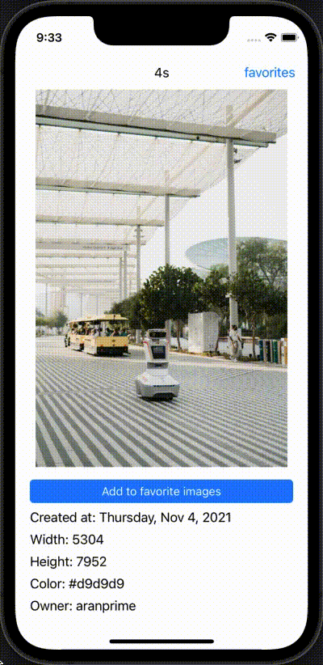
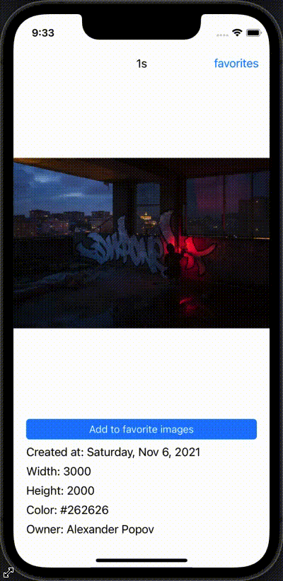

# Random image app
## Previews
| Change image by timer | Check if iamge already in DB | Add to favorites | Delete from favorites |
| :------------- :|:-------------:| :-----:| :-----:|
| |   |   | |

## About the project.

###### English
In that application I desided to make a custom servise which can directly take a random image with some info from unisplash.com and present it to user. 
In this app user can see random images. The image will change to a new one by timer. 
Also user can add image which they liked into favorites and see it in another screen. 
Also user can delete images from favorites. 

###### Russian
В этом приложении я решил создать специальный сервис, который может напрямую брать случайное изображение с некоторой информацией с unisplash.com и представлять его пользователю. 
В этом приложении пользователь может видеть случайные изображения. Изображение будет изменяться на новое по таймеру 
Также пользователь может добавить понравившееся изображение в избранное и просмотреть его на другом экране. 
Также пользователь может удалять изображения из избранного 

## Used technoligies
- Swift
- UIKit without any storyboards (programmatically)
- Coredata
- Unisplash.com API

## Future scope

###### English
I just finished writing some code. In it, you can notice that I used the MVP architecture at first, but then you will see noodles. So:
- I have to do a pure power MVP
- The application lacks element animation (fade in, fade out, and so on)
- Unit tests are also not written.
Actually, these three tasks I have to solve

###### Russian
Я только что закончил писать код. В нем вы можете заметить, что я сначала использовал архитектуру MVP, но потом вы увидите лапшу. Так что:
- Мне нужно сделать MVP в чистом виде
- В приложении отсутствует анимация элементов (нарастание, затухание и т. д.)
- Юнит-тесты тоже не пишутся.
Собственно, эти три задачи мне предстоит решить.
